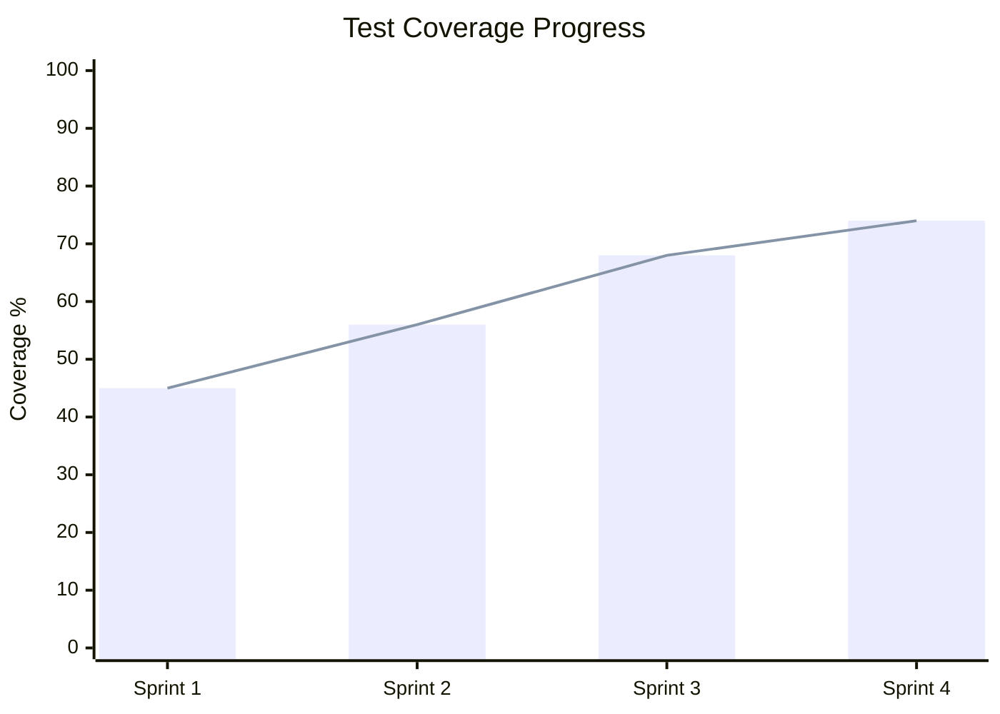
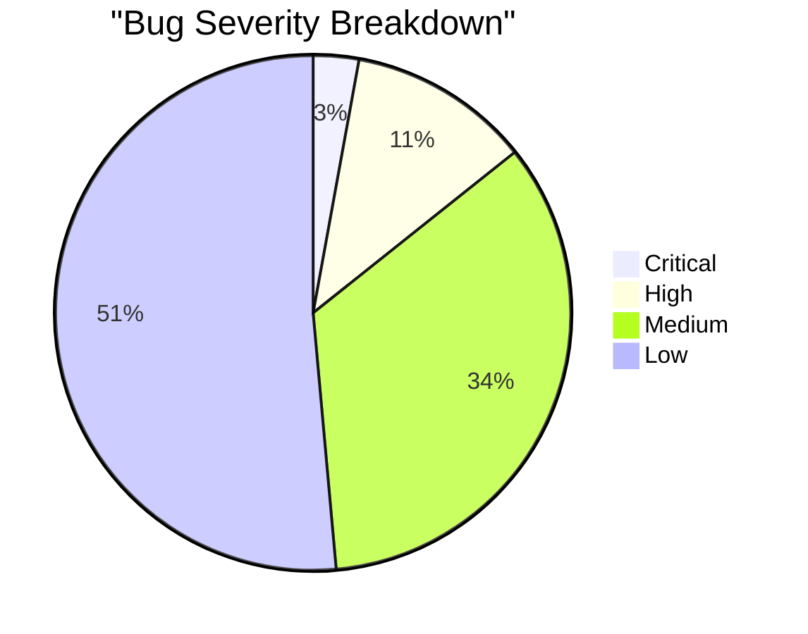

# Report Engineering

## Purpose
Reports fail when the writer optimizes for completeness rather than comprehension. A 20-page status report that nobody reads is worse than useless. This skill produces reports that match the audience's context: executives get the bottom line first, engineers get the data, and everyone gets clear next steps.

## SOP: Report Generation

### Step 1 - Audience and Report Type
Before writing, classify:

**Audience:**
- `executive`: Non-technical decision-maker. Needs impact and recommendations, not implementation details.
- `technical`: Engineer or tech lead. Needs specifics, data, and root cause.
- `mixed`: Product and engineering together. Lead with business impact, provide technical appendix.

**Report Type:**
- `status`: Periodic progress update (weekly/sprint/release).
- `incident`: Post-mortem of a production failure.
- `audit-summary`: High-level view of audit findings for non-technical readers.
- `release-notes`: What changed, what was fixed, what is known to be broken.

**Combination drives structure.** An executive incident report is very different from a technical post-mortem.

### Step 2 - BLUF Structure (All Reports)
Every report starts with the Bottom Line Up Front. The reader should know:
- What happened (or what the status is)
- What the impact is (numbers when possible)
- What action is required from them

*by the end of the first paragraph.* If they stop reading there, they have the information they need.

### Step 3 - Status Report Template

```markdown
# [Project] Status Report - [Sprint / Date]

## Bottom Line
[One paragraph: Are we on track? What is the biggest blocker? What is the recommended action?]

## Progress This Sprint
| Item | Status | Owner | Notes |
|---|---|---|---|
| Feature: User auth | Done | @dev1 | JWT + refresh tokens implemented |
| Feature: Payment flow | In Progress | @dev2 | Stripe integration at 70% |
| Bug: Avatar upload 500 | Done | @dev1 | Fixed S3 permission issue |

## Metrics
| Metric | This Sprint | Last Sprint | Target |
|---|---|---|---|
| API P95 Latency | 180ms | 220ms | < 200ms |
| Test Coverage | 74% | 68% | > 80% |
| Open Bugs (Critical/High) | 0/2 | 1/4 | 0/0 |

## Blockers
- [Blocker description] - Owner: @name - ETA to resolve: [date]

## Next Sprint
- [ ] Complete Stripe payment flow
- [ ] Reach 80% test coverage
```

### Step 4 - Incident Post-Mortem Template (Technical)

```markdown
# Incident Post-Mortem: [Brief Description]
Date: [YYYY-MM-DD] | Duration: [start] to [end] | Severity: [Critical/High]

## Bottom Line
[What broke, user impact in concrete terms, how it was resolved.]

## Timeline (UTC)
| Time | Event |
|---|---|
| 14:32 | Deployment of v2.1.4 to production |
| 14:40 | Error rate spike detected (alert triggered) |
| 14:45 | On-call engineer begins investigation |
| 15:02 | Root cause identified: missing DB index on `orders.status` |
| 15:15 | Index created, performance restored |

## Root Cause Analysis (5 Whys)
1. Why did the API slow down? -> `GET /orders` query took 8 seconds.
2. Why did the query take 8 seconds? -> Full table scan on 500k row `orders` table.
3. Why was there a full table scan? -> No index on the `status` column used in WHERE clause.
4. Why was there no index? -> The new WHERE clause was added in v2.1.4 without a corresponding migration.
5. Why did the migration review not catch this? -> No automated query performance test in the CI pipeline.

## Impact
- Users affected: ~2,400 (all users who loaded order history between 14:40 and 15:15)
- Revenue impact: $0 (orders were readable, not writable)
- Downtime: 35 minutes degraded performance, 0 minutes full outage

## Action Items
| Action | Owner | Due Date |
|---|---|---|
| Add query performance test (`EXPLAIN ANALYZE` assertion) to CI | @dev1 | 2024-02-10 |
| Add `db` skill checklist item for indexes on new WHERE columns | @arch | 2024-02-07 |
```

### Step 5 - Metrics and Charts
When metrics data is available, produce a Mermaid chart appropriate to the data type:

**Progress (xychart-beta):**


**Composition (pie):**


Use charts only when the data would be harder to interpret as a table. Do not produce charts for single data points.

### Step 6 - Tone Guide by Audience

**Executive:** Short sentences. Business language. Quantify everything in user or revenue impact. Never use acronyms without expanding them. No code.

**Technical:** Dense and precise. Include file names, error codes, query plans. Avoid softening language - say "the query was 40x slower" not "performance was somewhat degraded."

**Mixed:** Start with the executive summary (1 paragraph). Follow with the technical detail in a clearly labeled section. Allow each audience to stop reading when they have what they need.
