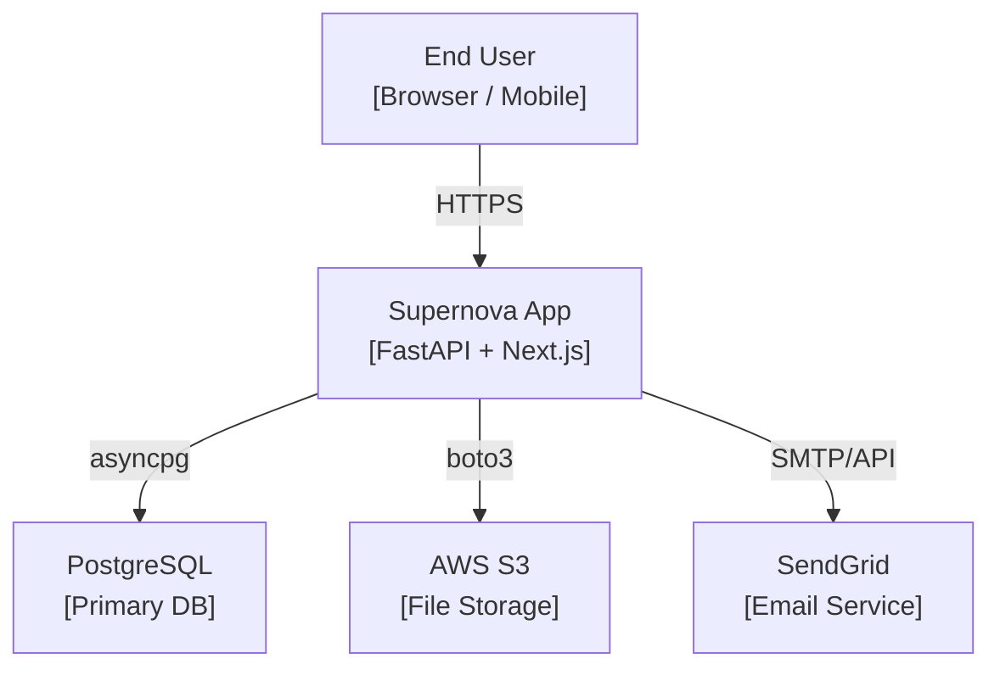
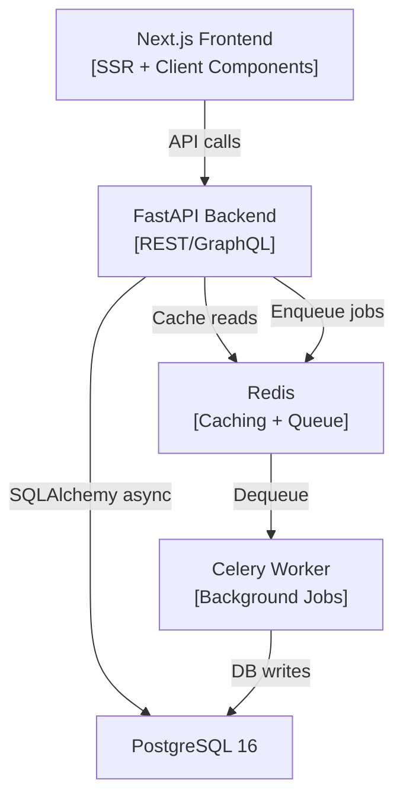

# System Architecture

## Purpose
Architecture decisions are the most expensive decisions in software development because they are the hardest to reverse. This skill's job is to force explicit reasoning about trade-offs before code is written. A 1-hour architecture session prevents a 3-week refactor.

## SOP: Architectural Design

### Step 1 - NFR Analysis (Non-Functional Requirements)
Before drawing any boxes, define the performance envelope. Fill this matrix:

| NFR | Target | Notes |
|---|---|---|
| Latency (P95) | e.g., < 200ms API response | Based on user expectations |
| Throughput | e.g., 100 req/s at launch, 1000 req/s in 12 months | Drives horizontal scaling decision |
| Availability | e.g., 99.9% (8.7hr downtime/year) | Drives redundancy design |
| Consistency | e.g., Strong (banking) vs Eventual (social feed) | Drives DB and cache choices |
| Data Retention | e.g., 7 years for compliance, 30 days for session data | Drives storage architecture |

If these targets are unknown, ask the user. Most vibe-coders will say "fast" and "always on" - help them translate this into concrete numbers.

### Step 2 - Architecture Pattern Selection
Choose the primary architecture pattern based on complexity and scale:

| Pattern | When to Use | Avoid When |
|---|---|---|
| Monolith (Single FastAPI app) | MVP, <5 engineers, <100k users | Team > 10, or bounded contexts are very large |
| Modular Monolith | Growing startup, clear domain separation needed | You need independent deploy of specific domains |
| Microservices | Multiple product lines, independent scaling needed, teams >10 | Early-stage startups (over-engineering) |
| Event-Driven | Async processing, fan-out notifications, audit logs | Simple CRUD apps |

Default for Supernova projects: **Modular Monolith** - one FastAPI app, internal domain modules (user/, orders/, payments/), clear module boundaries enforced by import rules.

### Step 3 - C4 Model Diagram Output
Produce architecture diagrams at two levels:

**Level 1: System Context (C4Context)**


**Level 2: Container Diagram (key services)**


### Step 4 - ADR (Architectural Decision Record) Format
For every significant non-obvious decision, write an ADR. Store in `docs/adr/` as `0001-use-postgresql.md`:

```markdown
# ADR 0001: Use PostgreSQL as Primary Database

## Status
Accepted

## Context
The application requires ACID transactions for payment records and relational data for users, orders, and products.

## Decision
We will use PostgreSQL 16 as the primary relational database, accessed via SQLAlchemy 2.0 async with asyncpg.

## Consequences
- Positive: Full ACID compliance, rich indexing (B-Tree, GIN, BRIN), row-level security, mature ecosystem.
- Negative: Requires schema migrations for structural changes (managed via Alembic).
- Negative: Horizontal write scaling requires read replicas or sharding (not needed at current scale).

## Alternatives Considered
- MongoDB: Rejected due to lack of relational integrity constraints needed for financial data.
- MySQL: Rejected due to weaker JSONB support and inferior full-text search.
```

### Step 5 - Data Flow Diagram
For each significant feature, produce a data flow showing where data originates, how it's processed, and where it lands:

```
User submits form
  -> [Frontend] react-hook-form validate -> POST /api/v1/orders
  -> [FastAPI Router] Pydantic model validation
  -> [Service] Business rule checks (inventory, price)
  -> [Repository] INSERT orders row + INSERT order_items rows (transaction)
  -> [Background Job] Send confirmation email via SendGrid
  -> [Response] 201 Created with OrderOut schema
```

This makes side effects explicit and prevents "where does this data go?" questions during code review.
