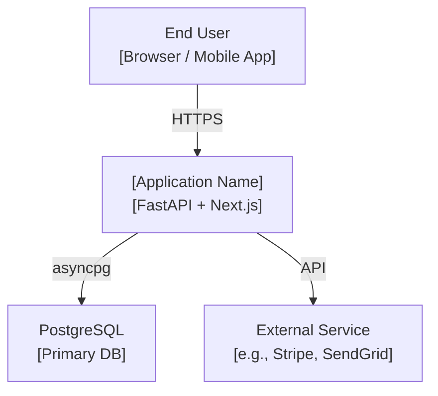
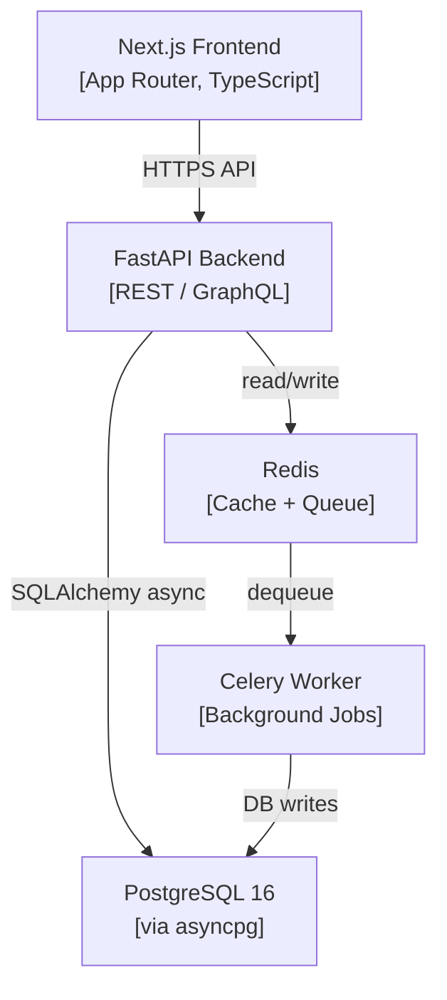

# Architectural Decision Record (ADR) Templates

## Standard ADR Template
Save as `docs/adr/NNNN-short-title.md` where NNNN is a zero-padded sequential number.

```markdown
# ADR [NNNN]: [Short Title]
Date: YYYY-MM-DD
Status: [Proposed | Accepted | Deprecated | Superseded by ADR-XXXX]
Deciders: [@name, @name]

## Context
[1-2 paragraphs explaining the situation and what forces the decision. Include constraints, existing systems, and technical context. Do not yet state the decision.]

## Decision
[The change being proposed or accepted. State it as "We will use X" or "We have decided to Y".]

## Consequences
### Positive
- [Benefit 1]
- [Benefit 2]

### Negative
- [Trade-off 1]
- [Trade-off 2]

### Risks
- [Risk 1 and its mitigation]

## Alternatives Considered
| Option | Why Rejected |
|---|---|
| [Alternative A] | [Reason] |
| [Alternative B] | [Reason] |
```

---

## Example ADRs for Common Supernova Decisions

### ADR-0001: Use PostgreSQL as Primary Database
```markdown
Status: Accepted

Context: Application requires ACID guarantees for financial records and multi-entity relational queries (users -> orders -> products).

Decision: We will use PostgreSQL 16+ with asyncpg + SQLAlchemy 2.0 async.

Consequences:
+ Full ACID, row-level security, rich indexing (B-Tree, GIN, partial).
- Schema migrations required via Alembic.
- Write scaling needs read replicas if >10k writes/min.

Alternatives: MongoDB (rejected: no FK integrity for financial data), MySQL (rejected: weaker JSONB, less powerful full-text search).
```

### ADR-0002: Use Modular Monolith Architecture
```markdown
Status: Accepted

Context: Team of 2 engineers, MVP stage, 3 domain modules (users, products, orders).

Decision: Single FastAPI app with internal module separation (src/domains/users/, src/domains/products/). Modules communicate via service calls, never direct DB imports across domains.

Consequences:
+ Single deploy unit, simpler ops, full ACID across domain boundaries.
- Cannot independently scale specific modules.

Upgrade path: If any domain grows to >3 engineers or >10k lines, extract to separate service at that time.
```

### ADR-0003: REST vs GraphQL API
```markdown
Status: Accepted

Context: Single known consumer (our own Next.js frontend). Data model is mostly flat CRUD with 3-4 entities.

Decision: FastAPI REST with OpenAPI auto-spec. Will re-evaluate if mobile app is added or entities exceed 8 with complex relationships.

Trigger for reconsideration: Adding a mobile app client or a second frontend with different data shape needs.
```

---

## C4 Diagram Templates

### Level 1: System Context


### Level 2: Container Diagram

