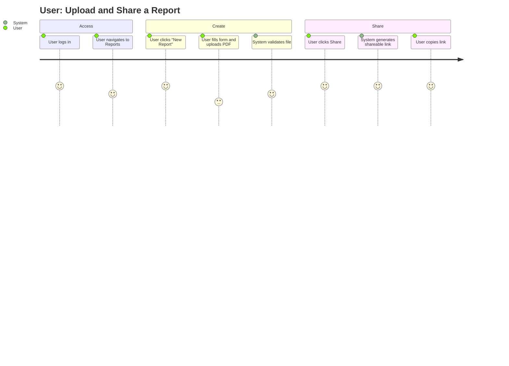

# UI/UX Design

## Purpose
UI/UX design exists to prevent the most common mistake in vibe-coded products: building what the developer imagined rather than what the user needs. This skill forces you to define the user's mental model and journey before committing pixels to screen. A 30-minute design step prevents a 3-day UI rebuild.

## SOP: UI/UX Design Workflow

### Step 1 - User & Goal Definition
Before designing anything, answer:
1. Who is the user? (A non-technical founder? A developer? A customer?)
2. What is the single most important action they must complete on this screen?
3. What is the emotional state they arrive in? (Frustrated? Curious? In a hurry?)

The answer shapes every decision below. A user who is "in a hurry" needs fewer clicks and no modals. A user who is "curious" can tolerate progressive disclosure.

### Step 2 - User Journey Mapping
Map the interaction as a Mermaid diagram before wireframing:



A score of 1-3 is a pain point. Design should eliminate or smooth 1-3 rated steps.

### Step 3 - Information Architecture
Define the visual hierarchy before choosing colors or components:

- **H1 (Page Title):** One per page. Describes the page's single purpose.
- **H2 (Section Headers):** Major functional areas on the page.
- **H3 (Card/Component Titles):** Individual content blocks.
- **Body:** Primary content. Should be the most text-dense layer.
- **Caption/Helper:** Secondary info. De-emphasize visually (smaller, muted color).

Apply the **F-pattern reading rule** for content-heavy pages: most visual weight belongs to the top-left. Place the most important action (CTA button) where the eye naturally rests after scanning.

### Step 4 - Tailwind Design Token Setup
The design system starts in `tailwind.config.ts` and `app/globals.css`, not in individual component files. Define semantic tokens:

```css
/* app/globals.css */
@layer base {
  :root {
    --background: 0 0% 100%;
    --foreground: 222.2 84% 4.9%;
    --primary: 222.2 47.4% 11.2%;
    --primary-foreground: 210 40% 98%;
    --muted: 210 40% 96.1%;
    --muted-foreground: 215.4 16.3% 46.9%;
    --border: 214.3 31.8% 91.4%;
    --radius: 0.5rem;
  }
  .dark {
    --background: 222.2 84% 4.9%;
    --foreground: 210 40% 98%;
    /* ... dark tokens ... */
  }
}
```

These `hsl(var(--token))` values are what Shadcn's components use. Customize the palette here, not inside component files.

**Typography scale** using `next/font`:
```tsx
// app/layout.tsx
import { Inter } from "next/font/google";
const inter = Inter({ subsets: ["latin"], variable: "--font-sans" });
```

Then in `tailwind.config.ts`:
```ts
fontFamily: { sans: ["var(--font-sans)", ...defaultTheme.fontFamily.sans] }
```

### Step 5 - Spacing & Layout System
Use the **4px base grid** exclusively. All spacing values are multiples of 4:

| Token | Value | Tailwind | Use Case |
|---|---|---|---|
| XS | 4px | `p-1` | Inner label padding |
| S | 8px | `p-2` | Button padding |
| M | 16px | `p-4` | Card internal padding |
| L | 32px | `p-8` | Section spacing |
| XL | 64px | `p-16` | Page section breaks |

Never use arbitrary values like `px-[13px]`. If a design calls for it, round to the nearest multiple of 4.

### Step 6 - Accessibility Checklist
Every UI deliverable must satisfy:

| Requirement | Standard | Check |
|---|---|---|
| Color contrast (text on bg) | WCAG AA (4.5:1 for normal text, 3:1 for large text) | Use `npx color-contrast-checker` |
| Interactive element labels | All `<button>`, `<input>`, `<a>` have `aria-label` or visible label | Manual review |
| Keyboard navigation | Tab order is logical; no keyboard traps | Test with Tab key only |
| Touch targets | Min 44x44px for mobile targets | Review with DevTools device mode |
| Focus ring | `:focus-visible` styles are visible, not removed | Check in browser |
| Image alt text | All `` have descriptive `alt` attributes | Code review |

Shadcn/ui and Radix UI components handle ARIA roles and keyboard navigation internally. When building custom components, use Radix UI primitives (`@radix-ui/react-dialog`, `@radix-ui/react-dropdown-menu`) rather than rolling your own.

### Step 7 - Mobile-First Breakpoint Strategy
Tailwind uses mobile-first breakpoints:

```tsx
<div className="
  grid grid-cols-1       // mobile: single column
  sm:grid-cols-2         // 640px+: two columns
  lg:grid-cols-3         // 1024px+: three columns
  gap-4 p-4 sm:p-6 lg:p-8
">
```

Design starts at 375px (iPhone SE). If it works at 375px, scale up. Never design desktop-first and retrofit mobile.

### Step 8 - Deliverable Format
When completing a UI/UX task, produce:

1. **User Journey Diagram:** Mermaid `journey` chart as shown in Step 2.
2. **Layout Descriptor:** Textual wireframe - e.g., "Header (sticky, h-16) | Left sidebar (w-64, hidden on mobile) | Main content (flex-1, scroll) | Right panel (w-80, hidden on md and below)".
3. **Component Inventory:** List of Shadcn/ui components needed and any custom Radix-based components to build.
4. **Accessibility Notes:** Any specific accessibility considerations for this flow.
